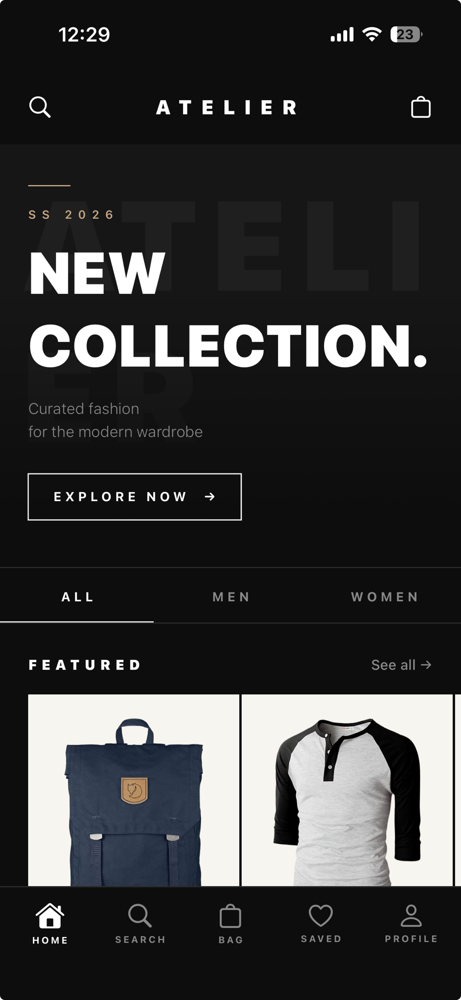
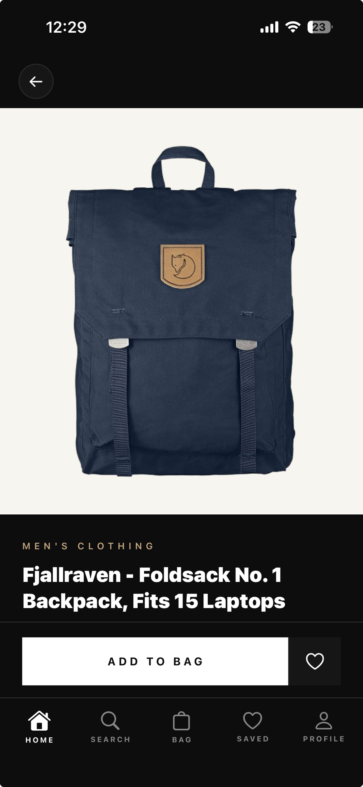
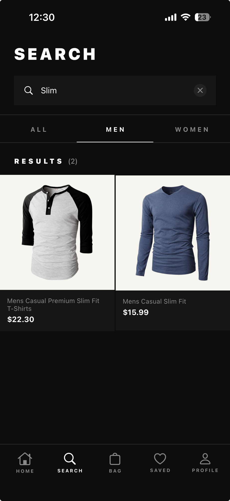
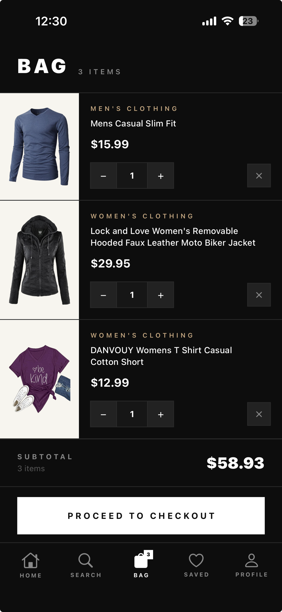
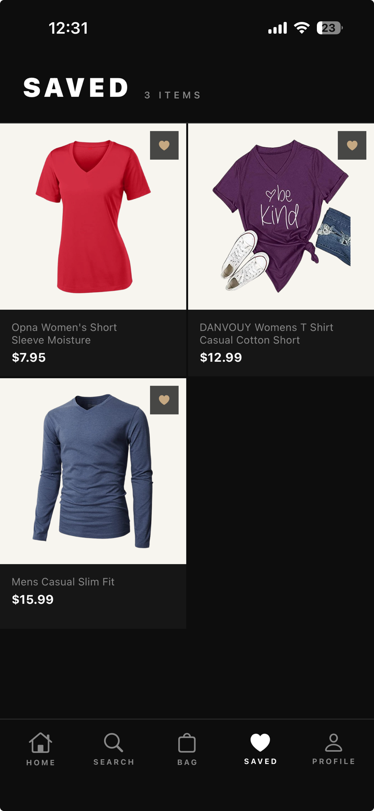
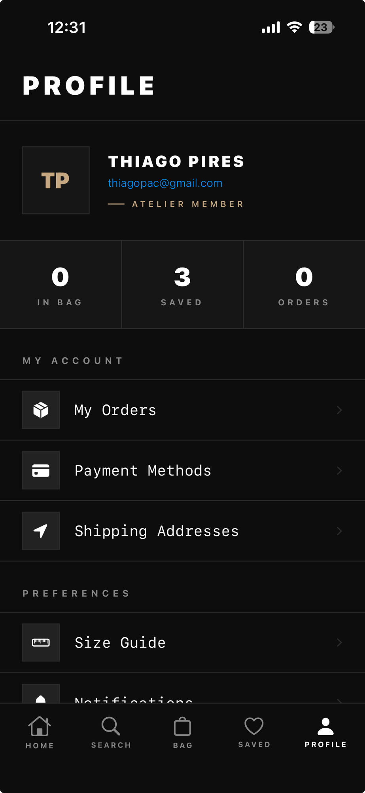

# Atelier

A fashion e-commerce app for iOS. Browse curated clothing collections, search by category, save favorites, and manage your shopping bag.

## Screenshots

<table>
  <tr>
    <td></td>
    <td></td>
    <td></td>
  </tr>
  <tr>
    <td align="center">Home</td>
    <td align="center">Product Detail</td>
    <td align="center">Search</td>
  </tr>
  <tr>
    <td></td>
    <td></td>
    <td></td>
  </tr>
  <tr>
    <td align="center">Bag</td>
    <td align="center">Saved</td>
    <td align="center">Profile</td>
  </tr>
</table>

## Tech stack

| | |
|---|---|
| Language | Swift 6 (Xcode 26) |
| UI | SwiftUI |
| Minimum deployment | iOS 18 |
| State management | `@Observable` macro |
| Networking | `URLSession` async/await |
| Navigation | `NavigationStack` + custom tab bar |
| Data source | [FakeStoreAPI](https://fakestoreapi.com) (clothing only) |

## Architecture

MVVM. Screens live in `Views/` grouped by feature, reusable cards in `Views/Components/`. Each screen with async data has a dedicated `@Observable` ViewModel.

**Custom tab bar** — built as a plain `ZStack` overlay instead of `TabView`, giving full control over styling, badge rendering, and keyboard behavior. Tabs are lazy-loaded on first visit to avoid upfront network requests.

**Shared stores** — `BagStore` and `SavedStore` are `@Observable` classes injected at the root via `.environment()`. Any view in the hierarchy can read or mutate bag and saved state without prop drilling.

**Category filtering** — the API returns all product categories; the app filters to men's and women's clothing client-side, with a segmented picker for per-category browsing.

**Dark editorial design** — a fully custom theme (`Theme.swift`) built around a near-black background, angular shapes with no rounded corners, and a warm gold accent. Typography mixes heavy sans-serif display text with serif body labels for a luxury fashion feel.

## Project structure

```
Atelier/
  Models/       — Codable data models (Product, BagItem, AppTab)
  Services/     — APIService, BagStore, SavedStore
  ViewModels/   — HomeViewModel, SearchViewModel
  Views/
    Components/ — ProductCardView, GridProductCardView
    Home/       — HomeView
    Detail/     — ProductDetailView
    Search/     — SearchView
    Bag/        — BagView
    Saved/      — SavedView
    Profile/    — ProfileView
  Theme/        — Color palette and global style constants
```
